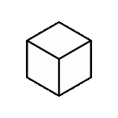

  
  
 
 <ul dsplay="inline-block">
    <li style="vertical-align:top;"> I'm 23y</li>
    <li> 🎓 Bachelor of Computer Science
    <li> 🌱 I’m currently Working for <a href="https://www.construtorapatriani.com.br/" target="_blank">Patriani</a> as Front End Developer
    <li> 🟢🟡Brazilian 🇧🇷
</ul>
 
  

  
 
  
 

 

  <!---->
<!--    -->
  <!--   -->
   
   
  

<h2>Technologies</h2>

 

  

  
  
  

